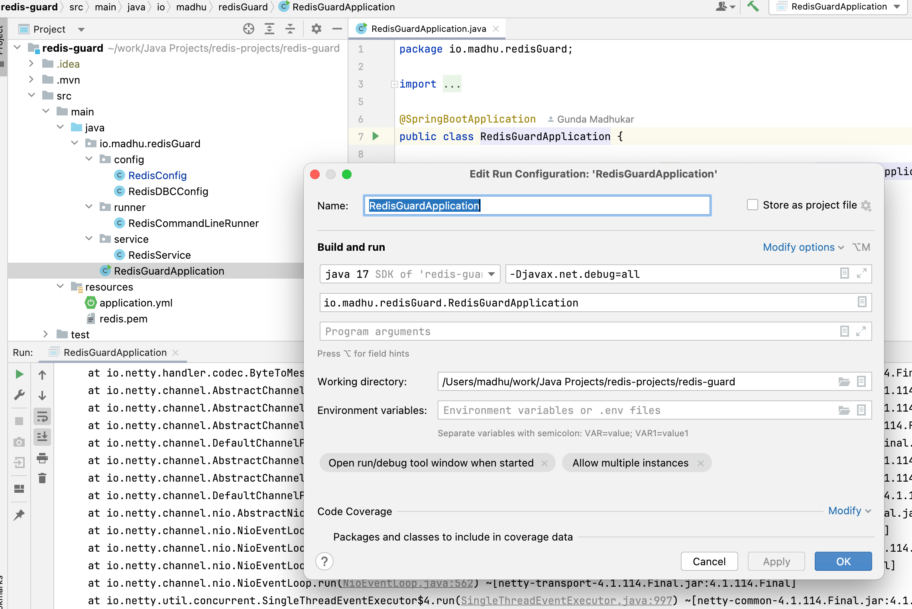
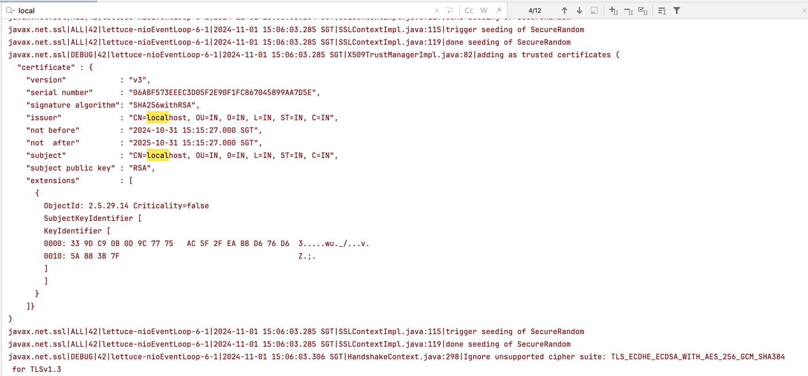
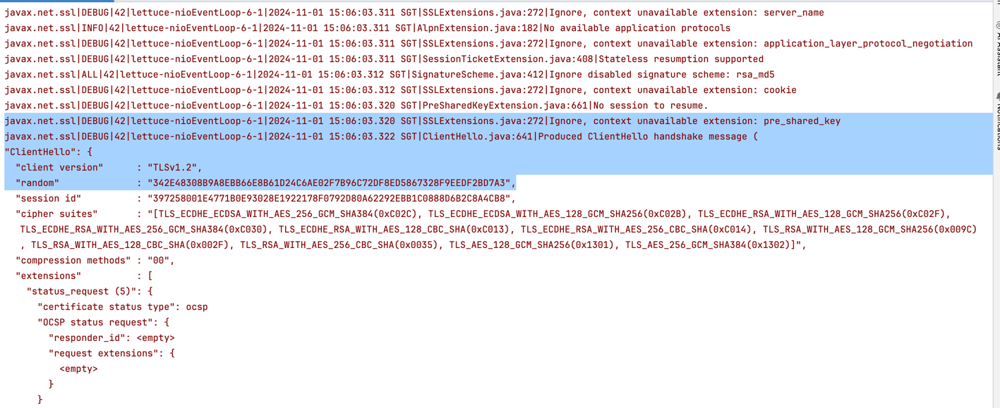
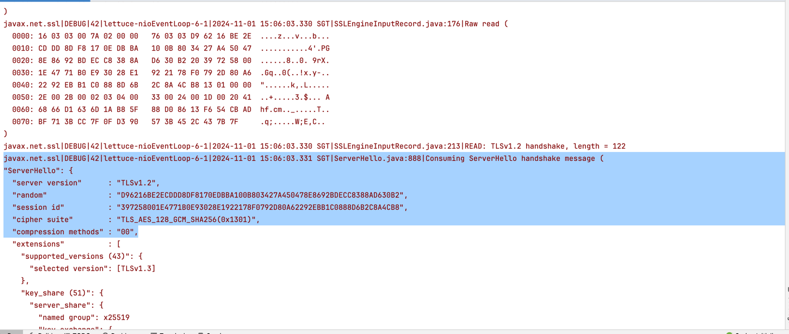
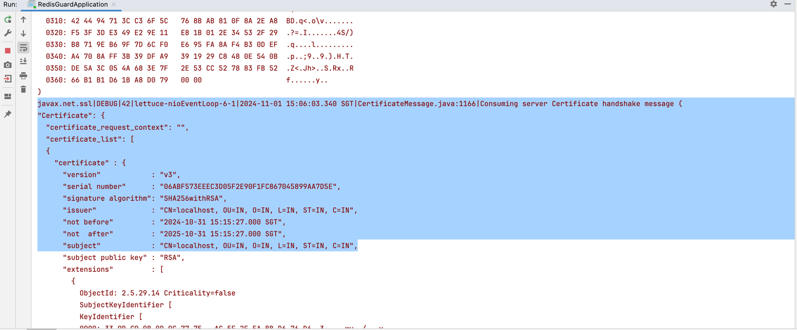
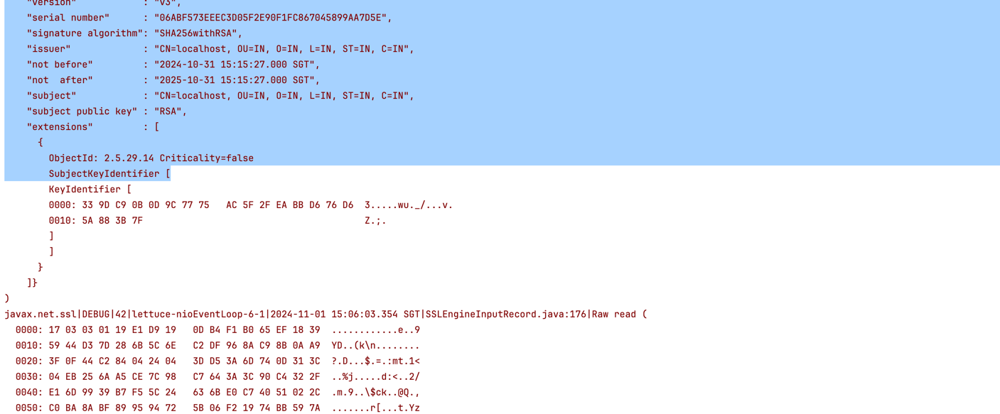
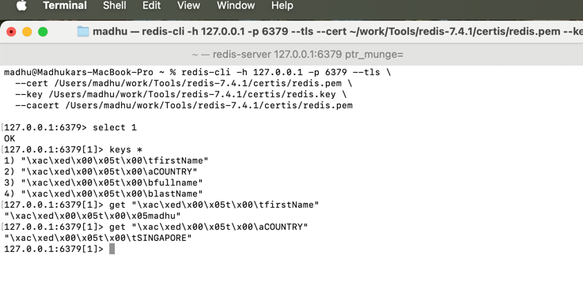

# Spring Boot Redis Connection with SSL/TLS and Self-Signed Certificates

This guide provides steps to set up and secure a Spring Boot Redis connection using SSL/TLS with self-signed certificates.
The instructions include generating certificates, configuring Redis and Java keystore, and setting up the Spring Boot configuration.

## Steps

### 1. Generate Self-Signed Certificates with OpenSSL

Run the following commands to generate the private key, certificate signing request (CSR), and self-signed certificate:

```bash
# Generate a private key
openssl genrsa -out redis.key 2048

# Generate a certificate signing request (CSR)
openssl req -new -key redis.key -out redis.csr -subj "/CN=localhost/OU=IT/O=OWN/L=PUNGGOL/ST=SINGAPORE/C=US"

# Generate a self-signed certificate
openssl x509 -req -days 365 -in redis.csr -signkey redis.key -out redis.pem
```

This generates:

- `redis.key`: The private key for Redis.
- `redis.csr`: The certificate signing request.
- `redis.pem`: The self-signed certificate.

### 2. Convert the PEM Certificate to DER Format

Java's `keytool` requires the certificate in DER format to import into the Java keystore (`cacerts`). Convert `redis.pem` to `redis.der`:

```bash
openssl x509 -outform der -in redis.pem -out redis.der
```

### 3. Import the Certificate into Java Keystore (`cacerts`)

To allow Java to trust the self-signed certificate, import `redis.der` into the Java keystore:

```bash
sudo keytool -import -alias redisCert -file redis.der -keystore /Library/Java/JavaVirtualMachines/jdk-17.jdk/Contents/Home/lib/security/cacerts
```

Provide the keystore password (default is usually `changeit`), and confirm the trust for this certificate.

### 4. Configure Redis to Use the Self-Signed Certificates

Move the `redis.key` and `redis.pem` files to the Redis directory, e.g., `/Users/madhu/work/Tools/redis-7.4.1/certis`.

In the Redis configuration file (`redis.conf`), add the following lines:

```bash
tls-port 6379
port 0
tls-cert-file /Users/madhu/work/Tools/redis-7.4.1/certis/redis.pem
tls-key-file /Users/madhu/work/Tools/redis-7.4.1/certis/redis.key
tls-ca-cert-file /Users/madhu/work/Tools/redis-7.4.1/certis/redis.pem

tls-auth-clients optional # No Mutual TLS is optional

user admin on >madhukar ~* +@all

```

### 5. Create Users in Redis

Define a Redis user with permissions and credentials. Start the Redis CLI:

```bash
redis-cli
```

Run the following commands to create a user with required permissions:

```bash
ACL SETUSER admin ON >password ~* +@all
```

Replace `password` with your desired password.

### 6. Start the Redis Server with TLS Enabled

```bash
redis-server /path/to/redis.conf
```

### 7. Run the Spring Boot Application

Start the Spring Boot application. It should now connect securely to the Redis server over TLS.

To debug SSL issues in your Java application, you can add the following JVM option to enable debugging for SSL and TLS connections:

-Djavax.net.debug=ssl:handshake:verbose

### 8. Run the Redis CLI command with TLS to verify if the TLS configuration was set up correctly.

redis-cli -h 127.0.0.1 -p 6379 --tls
--cert /Users/madhu/work/Tools/redis-7.4.1/certis/redis.pem
--key /Users/madhu/work/Tools/redis-7.4.1/certis/redis.key
--cacert /Users/madhu/work/Tools/redis-7.4.1/certis/redis.pem

---

This configuration enables a secure, SSL/TLS-protected connection between your Spring Boot application and Redis server using self-signed certificates.













```

```

### 9. In Case any issue debug using the following commadns

```shell
openssl x509 -in /Users/madhu/work/Tools/redis-7.4.1/certis/redis.pem -text -noout

openssl s_client -connect 127.0.0.1:6379 -cert /Users/madhu/work/Tools/redis-7.4.1/certis/redis.pem -key /Users/madhu/work/Tools/redis-7.4.1/certis/redis.key -CAfile /Users/madhu/work/Tools/redis-7.4.1/certis/redis.pem

```

### 10. Redis Database

1.Redis allowing us to store the data into logical partitions with in the Redis database server instance.
2.These daabases are numbered from 0 to 15 by default, give 16 database names.
3.Each Database is independent of the other database.
4.One database keys are not visible to other databases.
5.This is one of the way where we can keep the data separate with out having multiple redis instances.
6.By Default , Redis Client connect to database 0.
7.Using SELECT redis command we can switch database.

```shell
SELECT 0
```

